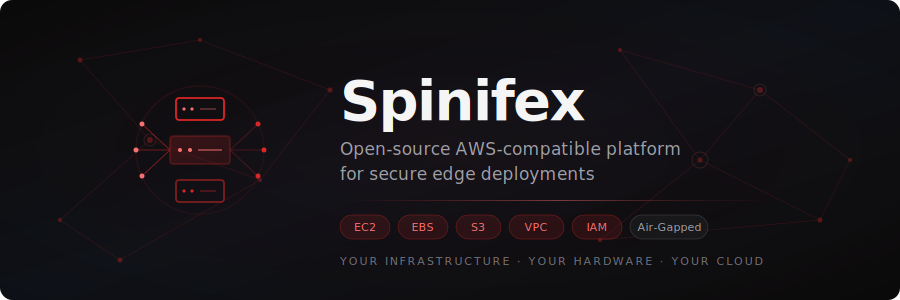
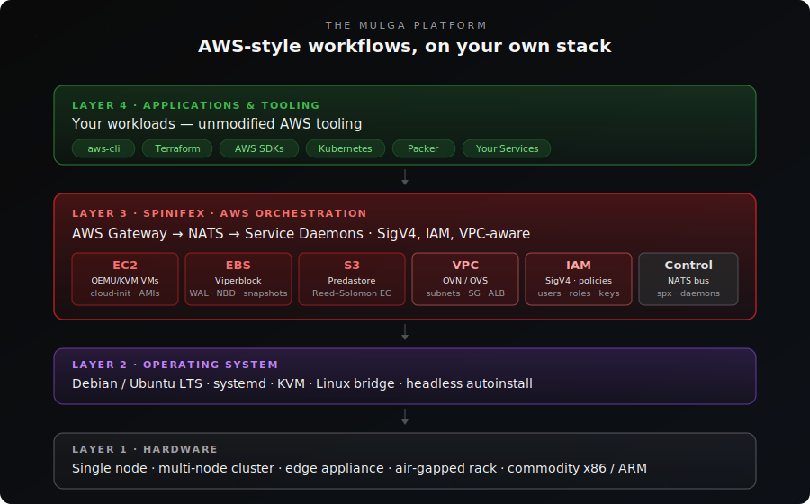
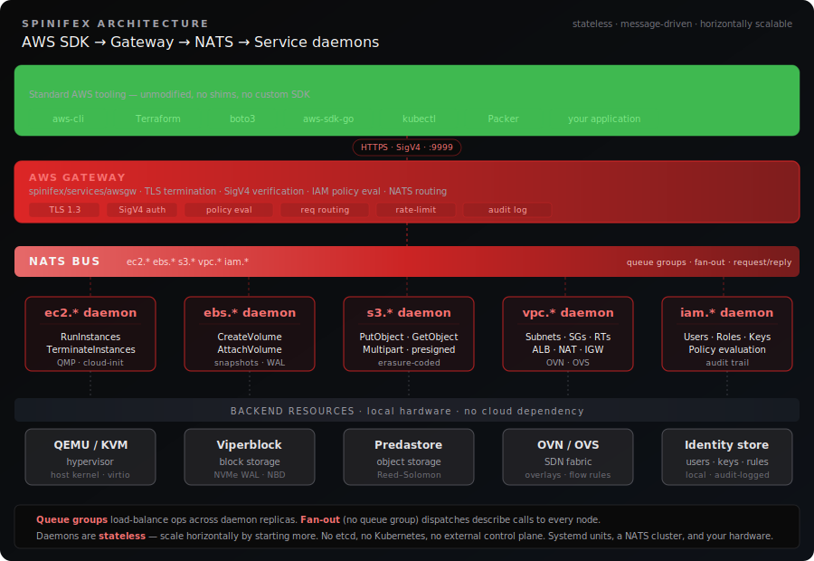
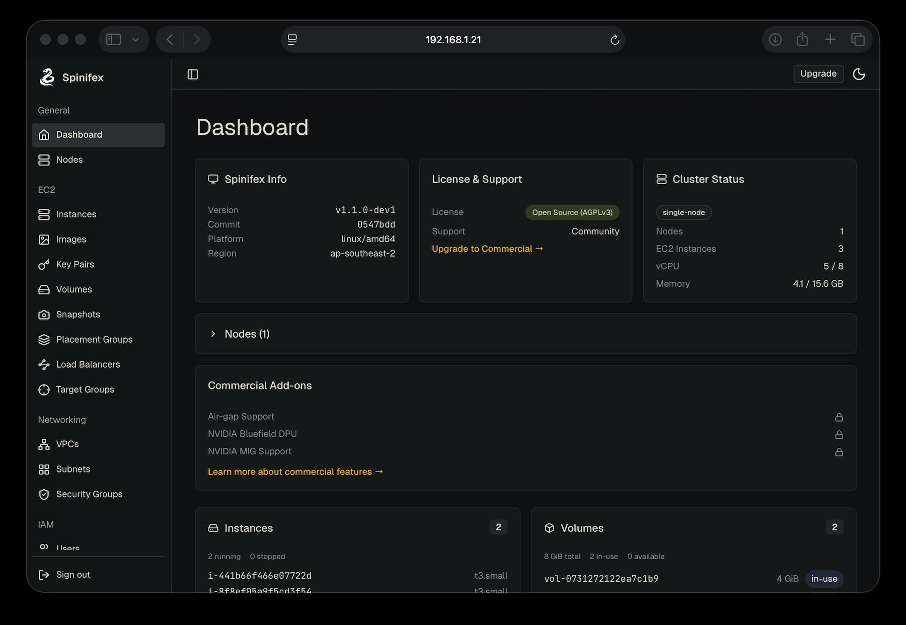

<p align="center">
  
</p>

<p align="center">
  <a href="https://go.dev"></a>
  <a href="LICENSE"></a>
  <a href="https://docs.mulgadc.com"></a>
</p>

<p align="center">
  <a href="#what-is-spinifex">What is Spinifex?</a> ·
  <a href="#the-platform">Platform</a> ·
  <a href="#core-components">Components</a> ·
  <a href="#architecture-at-a-glance">Architecture</a> ·
  <a href="#installation">Installation</a> ·
  <a href="https://docs.mulgadc.com">Docs</a>
</p>

---

# Spinifex: An Open Source AWS-Compatible Stack for Bare-Metal, Edge, and On-Prem Deployments

Spinifex developed by [Mulga Defense Corporation](https://mulgadc.com) is an open source infrastructure platform that brings the core services of AWS—like EC2, VPC, EBS, and S3—to environments where running in the cloud isn't an option. Whether you're deploying to edge sites, private data-centers, or need to operate in low-connectivity or highly contested environments, Spinifex gives you AWS-style workflows on your own hardware.

## What is Spinifex?

Spinifex replicates essential AWS primitives—virtual machines, block volumes, and object storage—using lightweight, self-contained components that are easy to deploy and integrate.

It's designed for developers and operators who need:

- Cloud-like infrastructure without the cloud
- Minimal dependencies, full control
- Drop-in compatibility with tools like the AWS CLI, SDKs, and Terraform
- A secure cloud environment you control and own the entire hardware, network and software stack

You can run Spinifex on a few servers in a rack, a field site, or anywhere centralized cloud services aren't feasible.

## The Platform

<p align="center">
  
</p>

From commodity hardware up to unmodified AWS tooling, every layer is replaceable and yours to own.

## Core Components

### Spinifex (Compute Service – EC2 Alternative)

Spinifex is a minimal VM orchestration layer built on top of QEMU, exposing APIs similar to EC2. It manages lifecycle operations like start, stop, and terminate, using QEMU's QMP interface. Designed to be straightforward and scriptable, Spinifex lets you launch VMs using the AWS CLI, SDKs, or Terraform—without needing Kubernetes or heavyweight orchestrators. Keep in mind, you can also setup a Kubernetes environment using Spinifex with underlying instances.

- EC2-like VM management on bare metal
- Launches with cloud-init metadata support
- Works with standard AWS tooling

### Viperblock (Block Storage – EBS Alternative)

[Viperblock](https://github.com/mulgadc/viperblock) is a high-performance, WAL-backed block storage service that replicates volumes across multiple nodes. It's built for reliability and speed, with support for snapshots, recovery, and direct connection to QEMU instances using NBD or virtio-blk.

- Fast, durable virtual disks
- Replication for resilience
- Exposed over NBD or embedded in VMs
- Supports high performance WAL logs using local NVMe drives to reduce IO traffic to S3.
- In memory read/write block cache for blazing performance.

### Predastore (Object Storage – S3-Compatible)

[Predastore](https://github.com/mulgadc/predastore) is a fully S3-compatible object storage system. It supports the AWS S3 API, including Signature V4 authentication, multipart uploads, and Terraform provisioning. Data is chunked and distributed across nodes using Reed-Solomon erasure coding, making it fault-tolerant and ideal for large-scale or low-bandwidth scenarios.

- S3-compatible API and auth
- Multipart uploads, streaming reads/writes
- Data redundancy with Reed-Solomon encoding

## Architecture at a Glance

<p align="center">
  
</p>

Every AWS API call is authenticated at the gateway, published to a NATS subject, and answered by whichever daemon claims it. Daemons are stateless — scale horizontally by starting more. No etcd, no Kubernetes, no external control plane. Deep dive: **[`docs/DESIGN.md`](docs/DESIGN.md)**.

## Key Features

AWS-Compatible Interfaces – Provision infrastructure with awscli, Terraform, or SDKs you already use.

- Designed for Control – Run on your own terms, whether that's in a datacenter, remote site, or sensitive environment.
- Minimal Dependencies – Each service is standalone and avoids complex orchestration layers.
- Works Offline – No reliance on centralized cloud services or external networks.
- Open Source – Licensed under AGPL 3.0. Fork it, extend it, or deploy it as-is.

## Installation

Installation requires an Ubuntu / Debian system. See the detailed documentation at [docs.mulgadc.com](https://docs.mulgadc.com) for maintaining and installing Spinifex.

### Single Node Install

The installation is straightforward to set up and running on a single node for testing purposes.

```bash
curl -fsSL https://install.mulgadc.com | bash

sudo /usr/local/share/spinifex/setup-ovn.sh --management

sudo spx admin init --node node1 --nodes 1

sudo systemctl start spinifex.target

export AWS_PROFILE=spinifex

aws ec2 describe-instance-types
```

### Development Setup

For a complete development environment see the [Source Install](https://docs.mulgadc.com/docs/install-source) documentation

### Component Repositories

Spinifex coordinates these independent components:

- **[Predastore](https://github.com/mulgadc/predastore)** - S3-compatible object storage
- **[Viperblock](https://github.com/mulgadc/viperblock)** - EBS-compatible block storage

Each component can be developed independently. See component-specific documentation for focused development guides.

## Spinifex UI

Spinifex ships with a built-in web console — an optional alternative to the AWS CLI, SDKs, and Terraform. If you're familiar with the AWS Management Console, the Spinifex UI fills the same role: a browser-based view of your instances, volumes, buckets, VPCs, and IAM resources, without leaving your own network.

<p align="center">
  
</p>

The console is served by each node on port `3000` over TLS, and becomes available as soon as `spinifex.target` is up:

```bash
open https://YOUR_NODE_IP:3000
```

- **Same API, different surface.** Every action in the UI is the same AWS SigV4 call the CLI makes — so RBAC, audit trails, and IAM policies apply uniformly.
- **Single sign-on against your AWS credentials.** Log in with the access keys from `~/.aws/credentials` on the node where Spinifex is installed — no separate user database.
- **Self-hosted, works offline.** The UI is embedded in the Spinifex binary and served from the node itself. No external CDN, no analytics calls, no cloud dependency.

For the full walkthrough — first-time TLS certificate trust, login, and feature tour — see [**Launching the Web UI**](https://docs.mulgadc.com/docs/setting-up-your-cluster#7-launching-the-web-ui) in the cluster setup guide.

## Development Philosophy

### Built by Engineers, For Engineers

Spinifex is developed by experienced infrastructure engineers with deep AWS expertise, including former AWS team members who understand the intricacies of building production-grade cloud services. Our team brings decades of combined experience from AWS, enterprise infrastructure, and edge computing environments.

**Real-World Experience:**

- Production AWS service development and operations
- Large-scale infrastructure deployment and management
- Edge computing and resource-constrained environments
- Enterprise security and compliance requirements

### AI-Assisted Development

While Spinifex is architected and implemented by experienced engineers, we leverage **Claude Code** (Anthropic's AI coding assistant) to accelerate certain development tasks. This approach combines human expertise with AI efficiency:

**How We Use Claude Code:**

- **Code Generation**: Boilerplate AWS API structures and handlers
- **Documentation**: Comprehensive development guides and API documentation
- **Testing**: Test case generation and validation scenarios
- **Refactoring**: Large-scale code restructuring and optimization

**What Remains Human-Driven:**

- **Architecture Decisions**: Core system design and scalability choices
- **Security Implementation**: Authentication, encryption, and threat modeling
- **Performance Optimization**: Real-world performance tuning and benchmarking
- **Production Operations**: Deployment strategies and operational procedures

This hybrid approach ensures Spinifex benefits from both proven engineering expertise and modern development acceleration, while maintaining the quality and reliability standards required for production infrastructure.

## License

Spinifex is open source under the [GNU Affero General Public License v3.0](LICENSE). You're free to use, modify, and deploy it anywhere you need reliable infrastructure without depending on centralized cloud platforms.
