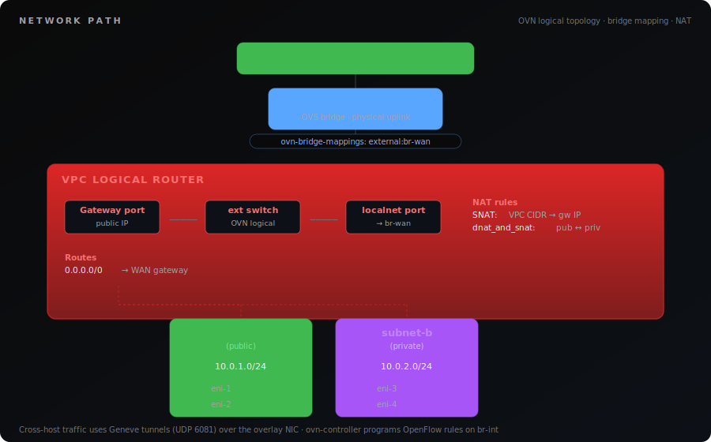
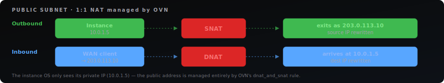
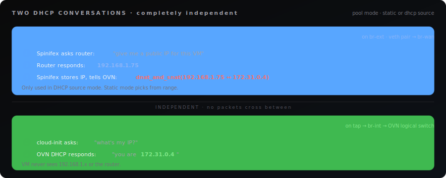
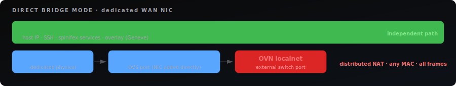
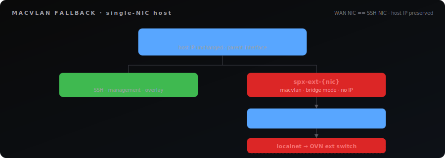
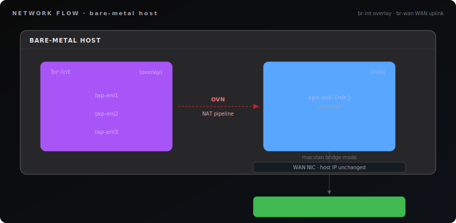
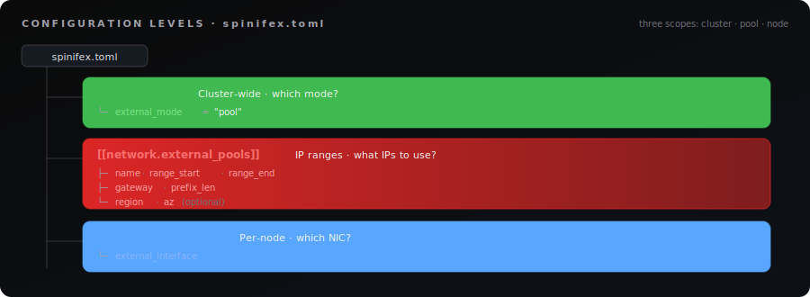

# VPC Networking

> How Spinifex implements AWS-compatible VPC networking with public and private subnets, security groups, and Elastic IPs using OVN.

## Overview

Spinifex provides AWS-compatible VPC networking on bare-metal. Every EC2 instance
runs inside an isolated virtual network backed by OVN (Open Virtual Network).
Instances can operate in two modes: **private** (overlay-only, no WAN access) or
**public** (routable from the WAN with a unique public IP).

## Instructions

## How It Works

Spinifex maps AWS VPC concepts directly to OVN constructs:

| AWS Concept      | OVN Construct            | What It Does                                       |
| ---------------- | ------------------------ | -------------------------------------------------- |
| VPC              | Logical Router           | Isolates tenant networks, routes between subnets   |
| Subnet           | Logical Switch + DHCP    | L2 broadcast domain with automatic IP assignment   |
| ENI              | Logical Switch Port      | Per-instance network interface with MAC/IP binding |
| Internet Gateway | External Switch + NAT    | Connects VPC router to physical WAN                |
| Security Group   | Port Group + ACLs        | Stateful firewall rules enforced in OVS datapath   |
| Elastic IP       | `dnat_and_snat` NAT rule | Static 1:1 NAT between public and private IP       |

## Network Path

<p align="center">
  
</p>

Cross-host traffic uses **Geneve tunnels** (UDP 6081) over the management/overlay
NIC. Each host runs `ovn-controller` which programs OpenFlow rules on `br-int`
(the integration bridge where all VM TAP devices connect).

## Private vs Public Subnets

A subnet's behavior depends on two things: whether the VPC has an Internet
Gateway, and whether the subnet has `MapPublicIpOnLaunch` enabled.

## Private Subnet (Default)

Instances get a private IP only. They can communicate with other instances in the
same VPC (even across subnets and hosts via the overlay). They cannot reach the
internet or be reached from the WAN.

<p align="center">
  
</p>

If the VPC has an IGW attached, private subnet instances CAN reach the internet
via the VPC router's SNAT rule (outbound only — they share the gateway IP). They
still cannot be reached from the WAN because they have no public IP.

## Public Subnet

Instances get both a private IP and a public IP. The public IP is a 1:1 NAT
managed by OVN — the instance OS only sees its private IP.

<p align="center">
  
</p>

**Requirements for a public subnet:**

1. VPC has an Internet Gateway attached
2. Subnet has `MapPublicIpOnLaunch = true`
3. External IP pool configured in `spinifex.toml`

## Comparison

|                          | Private Subnet                    | Public Subnet                  |
| ------------------------ | --------------------------------- | ------------------------------ |
| Private IP               | Yes                               | Yes                            |
| Public IP                | No                                | Auto-assigned from pool        |
| Outbound internet        | Only if VPC has IGW (shared SNAT) | Yes (own public IP via SNAT)   |
| Inbound from WAN         | No                                | Yes (via 1:1 NAT to public IP) |
| Instance sees public IP? | N/A                               | No — only sees private IP      |
| Elastic IP support       | Only if explicitly associated     | Yes                            |

## External Connectivity Modes

The `[network]` section in `spinifex.toml` controls how VMs reach the outside
world. There are three modes, and pool mode has two IP sources (static or DHCP).

## `pool` — Full Public Networking (Recommended)

Each VM in a public subnet gets its own public IP with bidirectional 1:1 NAT.
Supports the full AWS feature set: public subnets, auto-assign public IPs,
Elastic IPs, and security groups.

Pool mode supports two ways to obtain public IPs:

### Static Range (default)

The admin defines a range of routable IPs that Spinifex manages exclusively.

**Use when:** You have a block of IPs you control — datacenter ISP allocation,
homelab range carved out of your router's DHCP scope, enterprise DMZ range.

**Requirement:** The IP range must NOT be served by any other DHCP server. In a
homelab, shrink your router's DHCP scope to exclude the Spinifex range.

```toml
[network]
external_mode = "pool"

[[network.external_pools]]
name        = "wan"
range_start = "192.168.1.150"
range_end   = "192.168.1.250"
gateway     = "192.168.1.1"       # Router / next-hop IP
prefix_len  = 24
dns_servers = ["192.168.1.1", "8.8.8.8"]
```

### DHCP Source

Instead of a static range, public IPs come from the upstream router's DHCP
server. When a VM launches, Spinifex requests a DHCP lease from the router
on behalf of the VM. When the VM terminates, the lease is released.

The VM itself never talks to the router's DHCP — it only sees its private
VPC IP (from OVN's internal DHCP). The host-side DHCP conversation is
invisible to the guest.

**Use when:** You don't control a static IP block but the router's DHCP
server has enough leases. Homelabs where you don't want to carve out a range.
Environments where IPs are managed centrally by the network team's DHCP.

**Requirement:** `dhclient` or `dhcpcd-base` installed on the host.

```toml
[network]
external_mode = "pool"

[[network.external_pools]]
name        = "wan"
source      = "dhcp"              # "static" (default) or "dhcp"
gateway     = "192.168.1.1"       # Router / next-hop IP
prefix_len  = 24
dns_servers = ["192.168.1.1", "8.8.8.8"]
# No range_start/range_end — IPs come from router DHCP
```

### How Pool Mode Works (Both Sources)

Regardless of whether IPs come from a static range or DHCP, the OVN behavior
is identical:

<p align="center">
  
</p>

### Choosing Static vs DHCP

|                       | Static Range                                 | DHCP Source                                      |
| --------------------- | -------------------------------------------- | ------------------------------------------------ |
| **Public IPs from**   | Admin-defined `range_start`..`range_end`     | Router's DHCP server                             |
| **IP predictability** | You know the exact range                     | Router assigns whatever is available             |
| **Setup effort**      | Must reserve range, shrink router DHCP scope | Just set `source = "dhcp"`                       |
| **Dependency**        | None                                         | Requires `dhclient` on host, working router DHCP |
| **Best for**          | Datacenters, ISP blocks, production          | Homelabs, dev environments, shared networks      |
| **Capacity**          | Exact: `range_end - range_start` IPs         | Limited by router's DHCP pool size               |

Both support the same AWS features: public subnets, Elastic IPs, security groups,
DescribeInstances showing public IPs.

## `nat` — Outbound Only (Simple)

All VMs share a single external IP for outbound SNAT. No public IPs, no Elastic
IPs, no inbound from WAN. All subnets behave as private subnets with internet
access.

The `gateway_ip` is the IP that OVN uses for SNAT. You can set it statically or
use `setup-ovn.sh --dhcp` to obtain one from the router. This is the router's
DHCP — not Spinifex's internal OVN DHCP for VMs.

**Use when:** VMs only need outbound access (apt update, pulling images). Edge
deployments behind ISP NAT. Single WAN IP available. Future: use with AWS-style
NAT Gateway for private subnet internet access.

```toml
[network]
external_mode = "nat"

[[network.external_pools]]
name       = "wan"
gateway    = "192.168.1.1"
gateway_ip = "192.168.1.100"     # Single IP for all VM outbound SNAT
prefix_len = 24
```

## Disabled (Empty/Omitted)

VPC networking is overlay-only. No external connectivity. Instances can only
communicate within their VPC.

## Mode Comparison

| Capability                        | `pool` (static) | `pool` (dhcp) | `nat`    | Disabled |
| --------------------------------- | --------------- | ------------- | -------- | -------- |
| Outbound internet                 | Yes             | Yes           | Yes      | No       |
| Inbound from WAN                  | Yes (1:1 NAT)   | Yes (1:1 NAT) | No       | No       |
| Public subnets                    | Yes             | Yes           | No       | No       |
| Auto-assign public IPs            | Yes             | Yes           | No       | No       |
| Elastic IPs                       | Yes             | Yes           | No       | No       |
| DescribeInstances shows public IP | Yes             | Yes           | No       | No       |
| Admin must reserve IP range       | Yes             | No            | No       | No       |
| Needs router DHCP                 | No              | Yes           | Optional | No       |

If you start with `nat` and later need public subnets, switch to `pool` and
define a range (or use `source = "dhcp"`) — no data migration needed.

## Bridge Setup — Physical Network Wiring

OVN needs an OVS bridge for external connectivity. `setup-ovn.sh` auto-detects
the best approach:

- **Linux bridge on default route** (e.g. `br-wan` from cloud-init): Creates
  OVS bridge `br-ext` and links them with a veth pair. The Linux bridge keeps
  its IP and routes — no interruption. Bridge-mapping: `external:br-ext`.
- **OVS bridge on default route**: Uses it directly for bridge-mappings.
- **Physical NIC**: Stops and prints guidance (cannot safely move the NIC).

## Two Bridges, Two Jobs

Every Spinifex node has two OVS bridges:

| Bridge   | Purpose                              | Ports                        |
| -------- | ------------------------------------ | ---------------------------- |
| `br-int` | VM overlay traffic (Geneve tunnels)  | VM TAP devices, tunnel ports |
| `br-wan` | WAN uplink for public subnet traffic | macvlan on WAN NIC           |

`br-int` is always created by `setup-ovn.sh`. `br-wan` is created only when
a WAN bridge is configured (auto-detected or via `--wan-bridge`, required for public subnets / external connectivity).

The connection between them is logical, not physical — OVN's `localnet` port type
maps the logical external switch to `br-wan` via `ovn-bridge-mappings`.

<p align="center">
  
</p>

## Bridge Modes

Spinifex supports two ways to wire `br-wan` to the physical network.
**Direct bridge** is preferred when the host has a dedicated WAN NIC. **Macvlan**
is the fallback for single-NIC hosts where the WAN NIC is also the SSH NIC.

### Direct Bridge (Preferred)

The WAN NIC is added directly to `br-wan` as an OVS port. OVS sees all
traffic on the wire — any MAC, any protocol. No filtering, no workarounds.

<p align="center">
  
</p>

**Use when:** The host has a NIC dedicated to external/WAN traffic that is NOT
used for SSH or management. Datacenter servers with separate management +
public NICs. Homelab hosts with 2+ NICs.

**Benefits over macvlan:**

- **Distributed NAT**: DNAT processed on the VM's own chassis (no hairpin)
- **No MAC workarounds**: OVS sees all frames, any MAC
- **Host can reach VMs**: No macvlan parent↔child isolation
- **Better multi-node performance**: External traffic stays local
- **DHCP lease stability**: No MAC changes after lease

```bash
sudo setup-ovn.sh --wan-bridge=br-wan --wan-iface=eth1
```

### Macvlan (Fallback for Single-NIC)

A macvlan sub-interface is created in bridge mode off the WAN NIC, and that
macvlan is added to br-wan. The host keeps its IP on the original NIC —
SSH stays up.

<p align="center">
  
</p>

**Use when:** The WAN NIC is the same NIC used for SSH. Single-NIC homelabs,
edge deployments. Adding the NIC directly to OVS would break host connectivity.

**Limitations:**

- Centralized NAT only (macvlan filters unicast not matching its MAC)
- Host cannot reach VMs at their public IPs (macvlan isolation)
- vpcd must align macvlan MAC with OVN router MAC on startup
- Multi-node: all external traffic hairpins through the gateway chassis

```bash
sudo setup-ovn.sh --macvlan --wan-iface=eth0
```

### Mode Comparison

| Capability               | Direct bridge            | Macvlan                          |
| ------------------------ | ------------------------ | -------------------------------- |
| NAT mode                 | Distributed (local DNAT) | Centralized (gateway hairpin)    |
| Multi-node external perf | Optimal                  | Hairpin through gateway chassis  |
| Host → VM public IP      | Works                    | Blocked (kernel isolation)       |
| MAC alignment needed     | No                       | Yes (fragile startup step)       |
| Gratuitous ARPs needed   | No                       | Yes (`nat-addresses=router`)     |
| Works on single-NIC      | No (breaks SSH)          | Yes                              |
| DHCP lease stability     | Clean                    | Fragile (MAC changes post-lease) |

### How setup-ovn.sh Decides

| Flags                                  | Result                                          |
| -------------------------------------- | ----------------------------------------------- |
| `--wan-bridge=br-wan --wan-iface=eth1` | Direct bridge: NIC added to br-wan              |
| `--macvlan --wan-iface=eth0`           | Macvlan: sub-interface created, added to br-wan |
| (no WAN bridge)                        | Only br-int created, no WAN connectivity        |

### Setup (Macvlan Mode)

In environments where the WAN IP comes from a router's DHCP server (homelab,
small office), add `--dhcp` to obtain a gateway IP from the router automatically:

```bash
sudo setup-ovn.sh --macvlan --wan-iface=eth0 --dhcp
```

This requests an IP from the **router's DHCP** (e.g., 192.168.1.1 serving
addresses on the LAN). This is not Spinifex's internal OVN DHCP that assigns
private IPs to VMs — it's your network's existing DHCP server.

### Macvlan Internals

macvlan in `bridge` mode creates a virtual interface that shares the parent NIC's
physical wire but has its own MAC address. The Linux kernel blocks direct L2
frames between a parent interface and its macvlan children.

| Path                      | Works? | Why                                               |
| ------------------------- | ------ | ------------------------------------------------- |
| VM → internet             | Yes    | SNAT through OVN router → macvlan → WAN NIC → WAN |
| LAN device → VM public IP | Yes    | LAN → WAN NIC → macvlan → br-wan → OVN            |
| Host → VM public IP       | No     | macvlan isolation (kernel blocks parent↔child)    |
| Host → VM private IP      | Yes    | Overlay via br-int (unrelated to br-wan)          |

## Per-Node Configuration

Different nodes in a cluster can have different WAN NICs:

```toml
[nodes.node1.vpcd]
external_interface = "eth1"

[nodes.node2.vpcd]
external_interface = "eth0"

[nodes.node3.vpcd]
external_interface = "bond0"       # bonded NIC
```

Each node runs `setup-ovn.sh` with its own WAN bridge configuration. OVN doesn't
care which NIC the macvlan is on — only that `ovn-bridge-mappings` is set.

## Bridge Verification

```bash
# Check br-wan exists
sudo ovs-vsctl br-exists br-wan && echo "OK" || echo "MISSING"

# Check the physical port
sudo ovs-vsctl list-ports br-wan
# Multi-NIC: shows "eth1" (or your WAN NIC)
# Single-NIC: shows "spx-ext-eth0" (macvlan name)

# Check bridge mappings
sudo ovs-vsctl get Open_vSwitch . external-ids:ovn-bridge-mappings
# Output: "external:br-wan"

# Check macvlan (single-NIC only)
ip link show spx-ext-eth0
# Shows: state UP, type macvlan mode bridge
```

## Network Flow Diagram

<p align="center">
  
</p>

## Configuration Reference

All network configuration lives in `spinifex.toml`. Settings are split into three
levels: cluster-wide mode, IP pool definitions, and per-node NIC settings.

## Configuration Levels

<p align="center">
  
</p>

## Cluster-Wide: external_mode

```toml
[network]
external_mode = "pool"    # "pool", "nat", or "" (disabled)
```

| Value          | Behavior                                                          |
| -------------- | ----------------------------------------------------------------- |
| `"pool"`       | Full public networking — public subnets, auto-assign, Elastic IPs |
| `"nat"`        | Outbound-only SNAT — all VMs share one external IP                |
| `""` / omitted | Overlay-only — no external connectivity                           |

## IP Pools: network.external_pools

Each pool defines where external IPs come from. You can have one pool (homelab)
or many (multi-region datacenter).

```toml
[[network.external_pools]]
name        = "wan"                  # Pool identifier (unique within cluster)
source      = "static"              # "static" (default) or "dhcp"
range_start = "192.168.1.150"        # First allocatable IP (static source only)
range_end   = "192.168.1.250"        # Last allocatable IP (static source only)
gateway     = "192.168.1.1"          # WAN default gateway (next hop for 0.0.0.0/0)
gateway_ip  = ""                     # OVN router SNAT address (defaults to range_start)
prefix_len  = 24                     # Subnet mask length
region      = ""                     # Scope to region (optional)
az          = ""                     # Scope to AZ (optional)
dns_servers = ["8.8.8.8"]           # DNS for VMs (optional)
```

### Field Details

| Field         | Required    | Description                                                                                                                                                            |
| ------------- | ----------- | ---------------------------------------------------------------------------------------------------------------------------------------------------------------------- |
| `name`        | Yes         | Unique pool name. Used as NATS KV key and in `AllocateAddress`.                                                                                                        |
| `source`      | No          | IP source: `"static"` (default) uses `range_start`/`range_end`. `"dhcp"` obtains IPs from the router's DHCP server on each VM launch.                                  |
| `range_start` | Static only | First IP in the range. First IP is reserved for OVN gateway SNAT (unless `gateway_ip` overrides).                                                                      |
| `range_end`   | Static only | Last IP in the range.                                                                                                                                                  |
| `gateway`     | Yes         | Physical router/switch — the WAN default gateway. OVN sets `0.0.0.0/0 → gateway`.                                                                                      |
| `gateway_ip`  | NAT mode    | Static IP for OVN router SNAT. In pool mode, defaults to `range_start` (static) or first DHCP lease (dhcp). In NAT mode, this is the single external IP all VMs share. |
| `prefix_len`  | Yes         | Subnet mask for the external network (e.g., 24 = /24).                                                                                                                 |
| `region`      | No          | Scopes pool to a region. Instances in this region prefer this pool.                                                                                                    |
| `az`          | No          | Scopes pool to an AZ. More specific than region.                                                                                                                       |
| `dns_servers` | No          | DNS servers propagated to VMs via OVN DHCP.                                                                                                                            |

### Why range_start/range_end Instead of CIDR?

Customer IP ranges rarely align to CIDR boundaries. A datacenter might have
`203.0.113.10-203.0.113.200` from their ISP. Start/end avoids forcing admins to
calculate CIDR blocks.

### Gateway vs Gateway_IP

These are different things:

- **`gateway`** = Your network's default gateway (e.g., 192.168.1.1). This is
  where OVN sends packets destined for the internet. It's your router.
- **`gateway_ip`** = The IP that OVN uses for outbound SNAT. In pool mode,
  defaults to the first IP in the range. In NAT mode, set this explicitly.
  Must be on the same subnet as the gateway.

## Per-Node: nodes.NAME.vpcd

```toml
[nodes.spx1.vpcd]
ovn_nb_addr        = "tcp:10.1.3.181:6641"   # OVN Northbound DB
ovn_sb_addr        = "tcp:10.1.3.181:6642"   # OVN Southbound DB
external_interface = "eth1"                   # WAN NIC name
```

| Field                | Description                                                                                                                                                      |
| -------------------- | ---------------------------------------------------------------------------------------------------------------------------------------------------------------- |
| `external_interface` | Physical NIC for WAN traffic. A macvlan sub-interface is created on this NIC for br-wan. Different servers may have different names (eth1, eno2, enp3s0, bond0). |

## Pool Selection Logic

When an instance needs a public IP:

1. **AZ-scoped pool first**: Pool with matching `region` + `az`
2. **Region-scoped fallback**: Pool with matching `region`, no `az` (overflow)
3. **Unscoped fallback**: Pool with no `region`/`az` (global, homelab configs)
4. **Exhausted**: All pools full → `InsufficientAddressCapacity` error

`AllocateAddress` accepts optional pool name to target a specific block
(maps to AWS `PublicIpv4Pool`).

## IPAM Storage

Each pool gets a NATS KV entry in bucket `spinifex-external-ipam`, keyed by pool
name. Allocation uses CAS (Compare-And-Set) for lock-free concurrent access:

```json
{
  "pool_name": "wan",
  "range_start": "192.168.1.150",
  "range_end": "192.168.1.250",
  "allocated": {
    "192.168.1.150": { "type": "gateway" },
    "192.168.1.151": {
      "type": "auto_assign",
      "eni_id": "eni-abc",
      "instance_id": "i-123"
    }
  }
}
```

Pools are initialized from `spinifex.toml` on vpcd startup (idempotent).

## Deployment Examples

## Homelab / Dev (Single Pool)

```
Network: 192.168.1.0/24
Router: 192.168.1.1 (DHCP .2–.149)
Spinifex: 192.168.1.150–.250 (100 IPs)
```

```toml
[network]
external_mode = "pool"

[[network.external_pools]]
name        = "wan"
range_start = "192.168.1.150"
range_end   = "192.168.1.250"
gateway     = "192.168.1.1"
prefix_len  = 24

[nodes.homelab.vpcd]
external_interface = "eth0"
```

**Setup:** Change your router's DHCP range to end at .149. Run
`setup-ovn.sh --macvlan --wan-iface=eth0` (or auto-detected if WAN is already a bridge).

## Homelab / Dev (DHCP Pool — No Range Reservation)

```
Network: 192.168.1.0/24
Router: 192.168.1.1 (DHCP serves full range, no carve-out needed)
Spinifex: gets IPs from router DHCP on demand
```

```toml
[network]
external_mode = "pool"

[[network.external_pools]]
name        = "wan"
source      = "dhcp"
gateway     = "192.168.1.1"
prefix_len  = 24
dns_servers = ["192.168.1.1", "8.8.8.8"]

[nodes.homelab.vpcd]
external_interface = "eth0"
```

**Setup:** No router changes needed. Spinifex requests IPs from the router's
DHCP server when VMs launch and releases them on terminate. Requires `dhclient`
on the host (`apt install isc-dhcp-client`).

## Datacenter / Colo (ISP Block)

```
ISP-assigned: 203.0.113.0/28 (14 usable IPs)
ISP gateway: 203.0.113.1
Servers: 3x with separate mgmt (eth0) and public (eth1) NICs
```

```toml
[network]
external_mode = "pool"

[[network.external_pools]]
name        = "public"
range_start = "203.0.113.2"
range_end   = "203.0.113.14"
gateway     = "203.0.113.1"
prefix_len  = 28

[nodes.dc1.vpcd]
external_interface = "eth1"

[nodes.dc2.vpcd]
external_interface = "eth1"

[nodes.dc3.vpcd]
external_interface = "eno1"
```

## Enterprise On-Prem (VLAN)

```toml
[network]
external_mode = "pool"

[[network.external_pools]]
name        = "dmz"
range_start = "172.16.0.100"
range_end   = "172.16.0.200"
gateway     = "172.16.0.1"
prefix_len  = 24

[nodes.srv1.vpcd]
external_interface = "eth1.200"     # VLAN-tagged sub-interface

[nodes.srv2.vpcd]
external_interface = "bond0.200"    # Bonded NIC with VLAN tag
```

## Edge / Branch (Outbound Only)

```toml
[network]
external_mode = "nat"

[[network.external_pools]]
name       = "wan"
gateway    = "10.0.0.1"
gateway_ip = "10.0.0.50"
prefix_len = 24

[nodes.edge1.vpcd]
external_interface = "eth0"
```

## Multi-Region (Multiple Pools)

```toml
[network]
external_mode = "pool"

# US East — AZ-scoped
[[network.external_pools]]
name        = "us-east-1a"
range_start = "203.0.113.2"
range_end   = "203.0.113.254"
gateway     = "203.0.113.1"
prefix_len  = 24
region      = "us-east-1"
az          = "us-east-1a"

# US East — overflow (any AZ in region)
[[network.external_pools]]
name        = "us-east-overflow"
range_start = "192.0.2.2"
range_end   = "192.0.3.254"
gateway     = "192.0.2.1"
prefix_len  = 23
region      = "us-east-1"

# EU West
[[network.external_pools]]
name        = "eu-west"
range_start = "213.189.1.2"
range_end   = "213.189.2.254"
gateway     = "213.189.1.1"
prefix_len  = 23
region      = "eu-west-1"
```

Spinifex allocates from the correct pool based on where the instance launches.
An instance in `us-east-1a` gets an IP from `us-east-1a` first; if exhausted,
falls back to `us-east-overflow`.

## Security Groups

Security groups are stateful firewalls enforced at the OVS datapath level on
each hypervisor. Traffic is filtered before it reaches the wire — equivalent to
AWS Nitro card enforcement. The VM never sees dropped packets.

## How Security Groups Work

Each security group maps to an OVN **Port Group**. When an instance launches,
its ENI port is added to the port group(s) for its security groups. ACL rules
on the port group control traffic:

- **Default deny**: All inbound traffic dropped at priority 900
- **Allow rules**: Specific ports/protocols allowed at priority 1000 (overrides deny)
- **Stateful**: All allow rules use `allow-related` — return traffic is automatically permitted

## Default Security Group

Every VPC gets a default security group that:

- Allows all inbound from instances in the same security group
- Allows all outbound
- Denies all other inbound

## AWS Rule → OVN ACL Translation

| AWS Security Group Rule         | OVN ACL Match                                                      |
| ------------------------------- | ------------------------------------------------------------------ |
| Ingress TCP/22 from 0.0.0.0/0   | `outport == @sg && ip4 && tcp.dst == 22`                           |
| Ingress TCP/443 from 10.0.0.0/8 | `outport == @sg && ip4 && tcp.dst == 443 && ip4.src == 10.0.0.0/8` |
| Ingress ALL from sg-other       | `outport == @sg && ip4 && ip4.src == $sg_other_ip4`                |
| Ingress ICMP from anywhere      | `outport == @sg && ip4 && icmp4`                                   |
| Egress ALL to 0.0.0.0/0         | `inport == @sg && ip4`                                             |
| Default deny inbound            | `outport == @sg && ip4` (priority 900, action=drop)                |

## Example: Allow SSH + HTTP

```bash
# Create security group
SG=$(aws ec2 create-security-group --group-name web \
  --description "Web servers" --vpc-id $VPC \
  --query GroupId --output text)

# Allow SSH from anywhere
aws ec2 authorize-security-group-ingress --group-id $SG \
  --protocol tcp --port 22 --cidr 0.0.0.0/0

# Allow HTTP from anywhere
aws ec2 authorize-security-group-ingress --group-id $SG \
  --protocol tcp --port 80 --cidr 0.0.0.0/0

# Launch instance with this SG
aws ec2 run-instances --image-id $AMI --instance-type t3.small \
  --subnet-id $SUBNET --security-group-ids $SG --key-name mykey
```

Rule changes take effect immediately — no instance restart needed.

## Elastic IPs

Elastic IPs are static public IPs that persist across instance stop/start cycles.
Unlike auto-assigned public IPs (which change on stop/start), an Elastic IP stays
with your instance.

```bash
# Allocate
EIP=$(aws ec2 allocate-address --query AllocationId --output text)

# Associate with instance
aws ec2 associate-address --allocation-id $EIP --instance-id $INSTANCE

# Stop/start instance — same Elastic IP

# Disassociate
aws ec2 disassociate-address --association-id $ASSOC_ID

# Release back to pool
aws ec2 release-address --allocation-id $EIP
```

When you associate an Elastic IP with an instance that already has an
auto-assigned public IP, the auto-assigned IP is released and replaced.

## OVN Reference

For operators debugging or verifying the OVN topology.

## IGW Attach Creates

```bash
# External logical switch with localnet port
ovn-nbctl ls-add ext-{vpcId}
ovn-nbctl lsp-add ext-{vpcId} ext-localnet-{vpcId}
ovn-nbctl lsp-set-type ext-localnet-{vpcId} localnet
ovn-nbctl lsp-set-addresses ext-localnet-{vpcId} unknown
ovn-nbctl lsp-set-options ext-localnet-{vpcId} network_name=external

# Gateway router port with real external IP
ovn-nbctl lrp-add vpc-{vpcId} gw-{vpcId} {mac} 192.168.1.150/24

# Connect external switch to router
ovn-nbctl lsp-add ext-{vpcId} ext-rtr-{vpcId}
ovn-nbctl lsp-set-type ext-rtr-{vpcId} router
ovn-nbctl lsp-set-options ext-rtr-{vpcId} router-port=gw-{vpcId}

# Gateway chassis HA
ovn-nbctl lrp-set-gateway-chassis gw-{vpcId} chassis-1 20
ovn-nbctl lrp-set-gateway-chassis gw-{vpcId} chassis-2 15

# SNAT for all VPC traffic
ovn-nbctl lr-nat-add vpc-{vpcId} snat 192.168.1.150 10.0.0.0/16

# Default route to WAN
ovn-nbctl lr-route-add vpc-{vpcId} 0.0.0.0/0 192.168.1.1
```

## Per-Instance Public IP

```bash
# 1:1 NAT (centralized — processed on gateway chassis, uses router MAC)
ovn-nbctl lr-nat-add vpc-{vpcId} dnat_and_snat {public_ip} {private_ip}
```

> **Note:** Spinifex uses centralized NAT (no `external_mac` / `logical_port`)
> because macvlan-based external bridges can only receive unicast traffic matching
> the macvlan's own MAC. The router port MAC is set on the macvlan, and OVN uses
> it for all ARP replies. For single-node, there is no performance difference.

## Security Group

```bash
# Create port group
ovn-nbctl pg-add sg-{groupId}

# Add VM ports
ovn-nbctl pg-set-ports sg-{groupId} port-{eniId1} port-{eniId2}

# Allow SSH inbound (stateful)
ovn-nbctl acl-add sg-{groupId} to-lport 1000 \
  'outport == @sg_{groupId} && ip4 && tcp.dst == 22' allow-related

# Allow all egress
ovn-nbctl acl-add sg-{groupId} from-lport 1000 \
  'inport == @sg_{groupId} && ip4' allow-related

# Default deny inbound
ovn-nbctl acl-add sg-{groupId} to-lport 900 \
  'outport == @sg_{groupId} && ip4' drop
```

## Useful Debug Commands

```bash
# List all logical routers (VPCs)
sudo ovn-nbctl lr-list

# List all logical switches (subnets + external)
sudo ovn-nbctl ls-list

# Show NAT rules for a VPC
sudo ovn-nbctl lr-nat-list vpc-{vpcId}

# Show routes for a VPC
sudo ovn-nbctl lr-route-list vpc-{vpcId}

# Show chassis (nodes) in the cluster
sudo ovn-sbctl show

# Show port bindings (which VM is on which host)
sudo ovn-sbctl find Port_Binding type="" | grep -E "logical_port|chassis"

# Check ACLs on a security group
sudo ovn-nbctl acl-list sg-{groupId}

# Check port group membership
sudo ovn-nbctl pg-get-ports sg-{groupId}
```

## Quick Start

## 1. Set Up OVN Bridges

```bash
sudo setup-ovn.sh --macvlan --wan-iface=eth0
```

## 2. Configure External IP Pool

```bash
spx admin init
# Follow prompts — auto-detects NICs, suggests IP pool range
# Or edit spinifex.toml manually
```

## 3. Create VPC with Public Subnet

```bash
VPC=$(aws ec2 create-vpc --cidr-block 10.200.0.0/16 \
  --query Vpc.VpcId --output text)

SUBNET=$(aws ec2 create-subnet --vpc-id $VPC \
  --cidr-block 10.200.1.0/24 \
  --query Subnet.SubnetId --output text)

IGW=$(aws ec2 create-internet-gateway \
  --query InternetGateway.InternetGatewayId --output text)
aws ec2 attach-internet-gateway \
  --internet-gateway-id $IGW --vpc-id $VPC

aws ec2 modify-subnet-attribute \
  --subnet-id $SUBNET --map-public-ip-on-launch
```

## 4. Launch Instance

```bash
INSTANCE=$(aws ec2 run-instances \
  --image-id $AMI --instance-type t3.small \
  --subnet-id $SUBNET --key-name mykey \
  --query Instances[0].InstanceId --output text)

aws ec2 describe-instances --instance-ids $INSTANCE \
  --query 'Reservations[0].Instances[0].[PrivateIpAddress,PublicIpAddress]'
```

## Troubleshooting

### Debugging Toolkit

These commands are used throughout the troubleshooting sections below. Learn
them — they cover 90% of VPC networking issues.

### OVN Northbound (Logical Topology)

```bash
# Full topology overview (routers, switches, ports)
sudo ovn-nbctl show

# List all VPC routers
sudo ovn-nbctl lr-list

# List all switches (subnets + external)
sudo ovn-nbctl ls-list

# NAT rules for a VPC
sudo ovn-nbctl lr-nat-list vpc-{vpcId}

# Routes for a VPC
sudo ovn-nbctl lr-route-list vpc-{vpcId}

# Port details (check "up" field for DHCP status)
sudo ovn-nbctl list Logical_Switch_Port port-eni-{eniId}

# Gateway chassis assignment
sudo ovn-nbctl list Logical_Router_Port gw-vpc-{vpcId}

# Localnet port options (check nat-addresses=router)
sudo ovn-nbctl get Logical_Switch_Port ext-port-vpc-{vpcId} options
```

### OVN Southbound (runtime state)

```bash
# Chassis list + port bindings (which VM is on which host)
sudo ovn-sbctl show

# Detailed chassis info (check name matches expectations)
sudo ovn-sbctl list Chassis

# MAC binding table (shows ARP resolution for external traffic)
sudo ovn-sbctl list MAC_Binding

# Trace a packet through the OVN pipeline (invaluable for debugging)
sudo ovn-trace ext-vpc-{vpcId} \
  'inport=="ext-port-vpc-{vpcId}" && eth.dst==ff:ff:ff:ff:ff:ff && \
   arp.op==1 && arp.spa==192.168.1.13 && arp.tpa==192.168.1.201'
```

### OVS (datapath / physical wiring)

```bash
# Full bridge + port topology
sudo ovs-vsctl show

# Kernel datapath ports and stats
sudo ovs-dpctl show

# Kernel datapath flow cache (actual forwarding rules)
sudo ovs-dpctl dump-flows

# OpenFlow rules installed by ovn-controller
sudo ovs-ofctl dump-flows br-int | grep {pattern}

# Conntrack entries (shows active NAT sessions)
sudo ovs-appctl dpctl/dump-conntrack | grep {ip}

# FDB (MAC address table) for a bridge
sudo ovs-appctl fdb/show br-wan

# OVS external_ids (system-id, bridge-mappings, encap-ip)
sudo ovs-vsctl get Open_vSwitch . external_ids
```

### Network Interfaces

```bash
# Check macvlan exists and has correct MAC
ip -d link show spx-ext-{nic}

# Check macvlan is attached to OVS (look for "openvswitch_slave")
ip -d link show spx-ext-{nic} | grep openvswitch

# Interface traffic stats (RX/TX counts, drops)
ip -s link show spx-ext-{nic}
```

### Packet Capture

```bash
# Capture on the OVS bridge (sees traffic after OVS processing)
sudo tcpdump -i br-wan -n -e arp

# Capture on the macvlan (sees what leaves/enters the wire)
sudo tcpdump -i spx-ext-{nic} -n -e "host {public_ip}"

# Capture on the physical NIC (sees everything on the wire)
sudo tcpdump -i {nic} -n "host {public_ip}"
```

### Service Logs

```bash
# vpcd log (reconcile, NAT, topology operations)
cat ~/spinifex/logs/vpcd.log

# ovn-controller log (port binding, commit failures)
sudo cat /var/log/ovn/ovn-controller.log | tail -50

# Daemon log (instance launch, network setup)
cat ~/spinifex/logs/spinifex.log
```

### VPC Creation Fails

Check OVN services and vpcd daemon:

```bash
sudo systemctl is-active ovn-controller
cat ~/spinifex/logs/vpcd.log
```

### Instances Cannot Reach Each Other

Geneve tunnels may not be established:

```bash
sudo ovs-vsctl show | grep -i geneve
sudo ss -ulnp | grep 6081
```

From inside a VM:

```bash
ip addr show
ip route show
```

### Instance Has No Public IP

1. Check subnet has `MapPublicIpOnLaunch`:

   ```bash
   aws ec2 describe-subnets --subnet-ids $SUBNET \
     --query 'Subnets[0].MapPublicIpOnLaunch'
   ```

2. Check IGW is attached:

   ```bash
   aws ec2 describe-internet-gateways \
     --filters Name=attachment.vpc-id,Values=$VPC
   ```

3. Check external IP pool:

   ```bash
   nats kv get spinifex-external-ipam wan
   ```

4. Check OVN NAT rules:
   ```bash
   sudo ovn-nbctl lr-nat-list vpc-$VPC
   ```

### Public IP Not Reachable from WAN

Work through these checks in order — each eliminates a class of issues.

### 1. Verify OVS wiring

```bash
# br-wan must exist with the macvlan port
sudo ovs-vsctl show | grep -A5 br-wan

# Bridge mappings must be set
sudo ovs-vsctl get Open_vSwitch . external-ids:ovn-bridge-mappings
# Expected: "external:br-wan"
```

### 2. Verify chassis and gateway scheduling

```bash
# What OVS thinks the chassis name is
sudo ovs-vsctl get Open_vSwitch . external-ids:system-id

# What OVN SB registered (must match the system-id above)
sudo ovn-sbctl show
# Look for: Chassis {name}

# What vpcd scheduled as gateway chassis (must match SB chassis name)
sudo ovn-nbctl list Logical_Router_Port gw-vpc-{vpcId} | grep gateway_chassis
```

If these don't match, see "Chassis name mismatch" below.

### 3. Verify NAT rule

```bash
sudo ovn-nbctl lr-nat-list vpc-$VPC | grep dnat_and_snat
# Must show the public IP → private IP mapping
# Must NOT have external_mac or logical_port set (centralized NAT)
```

### 4. Verify ARP resolution

From another host on the same LAN, check if OVN responds to ARP:

```bash
# On the remote host:
ping -c 1 {public_ip}
ip neigh show {public_ip}
# Should show the OVN router MAC (02:00:00:xx:xx:xx)
```

If ARP fails, check the macvlan MAC alignment:

```bash
# On the Spinifex host:
# Gateway router MAC
sudo ovn-nbctl get Logical_Router_Port gw-vpc-{vpcId} mac
# Macvlan MAC
ip link show spx-ext-{nic} | grep ether

# These MUST match. If they don't, vpcd failed to set the macvlan MAC.
# Check vpcd.log for "macvlan MAC aligned" or errors.
```

### 5. Verify packet flow with tcpdump

Capture at each layer to find where packets stop:

```bash
# Layer 1: Does the ARP/ICMP arrive on the physical NIC?
sudo tcpdump -i {nic} -n "host {public_ip}"

# Layer 2: Does it reach br-wan?
sudo tcpdump -i br-wan -n "host {public_ip}"

# Layer 3: Does it reach the macvlan output?
sudo tcpdump -i spx-ext-{nic} -n -e "host {public_ip}"
```

If traffic arrives on the physical NIC but not br-wan, the macvlan is
filtering it. Check MAC alignment (step 4).

### 6. Use ovn-trace for pipeline debugging

Simulate a packet through the entire OVN pipeline:

```bash
sudo ovn-trace --ct=new ext-vpc-{vpcId} \
  'inport=="ext-port-vpc-{vpcId}" && eth.dst==ff:ff:ff:ff:ff:ff && \
   arp.op==1 && arp.sha=={remote_mac} && arp.spa=={remote_ip} && \
   arp.tpa=={public_ip}'
```

The output shows every table the packet passes through and what action is
taken. Look for `drop` actions or unexpected paths.

### OVN SB Commit Failure Loop

**Symptom:** ovn-controller log shows:

```
OVNSB commit failed, force recompute next time.
```

Repeated millions of times. Port binding never happens (`up: false`).

**Cause:** Stale entries in the OVN Southbound DB (old chassis records, port
bindings, datapath bindings) conflict with ovn-controller's expected state.
Happens when `reset-dev-env.sh` cleans NB but not SB, or after ungraceful
shutdowns.

**Fix:** Delete both OVN DB files and restart. `reset-dev-env.sh` does this
automatically:

```bash
sudo systemctl stop ovn-central ovn-controller
sudo rm -f /var/lib/ovn/ovnnb_db.db /var/lib/ovn/ovnsb_db.db
sudo systemctl start ovn-central ovn-controller
# vpcd reconcile will recreate the NB topology on next startup
```

### Chassis Name Mismatch

**Symptom:** Gateway chassis is set in NB but the SB has no matching chassis.
`ovn-nbctl show` reports a gateway chassis name that doesn't appear in
`ovn-sbctl show`. Gateway traffic (SNAT/DNAT) doesn't work.

**Cause:** Three names must align:

1. OVS `external_ids:system-id` → what ovn-controller registers as
2. OVN SB `Chassis.name` → what actually exists in the SB DB
3. vpcd's chassis name → `chassis-{nodeName}` from config

If `setup-ovn.sh` used `chassis-$(hostname -s)` but vpcd uses
`chassis-{nodeName}`, they'll differ on any host where hostname ≠ node name.

**Diagnosis:**

```bash
# What OVS has
sudo ovs-vsctl get Open_vSwitch . external-ids:system-id
# What SB registered
sudo ovn-sbctl list Chassis | grep name
# What vpcd expects
grep node ~/spinifex/config/spinifex.toml | head -1
```

**Fix:** `reset-dev-env.sh` passes `--chassis-id=chassis-node1` to
`setup-ovn.sh`. For manual fix:

```bash
sudo ovs-vsctl set Open_vSwitch . external_ids:system-id=chassis-node1
sudo systemctl restart ovn-controller
```

### Macvlan Unicast Filtering (Inbound Traffic Lost)

**Symptom:** VM gets DHCP, outbound works (ping 8.8.8.8 from VM), but inbound
from the LAN to the VM's public IP fails. ARP replies go out but ICMP never
arrives at br-wan.

**Cause:** macvlan in bridge mode only delivers unicast frames matching its own
MAC. OVN announces the router MAC for external IPs, but the macvlan has a
different (random) MAC. Broadcasts (ARP requests) pass through; unicast return
traffic is filtered by the kernel macvlan subsystem.

**Diagnosis:**

```bash
# Compare these two — they must match
sudo ovn-nbctl get Logical_Router_Port gw-vpc-{vpcId} mac
ip link show spx-ext-{nic} | grep ether

# If they differ, inbound unicast is being dropped
```

**Fix:** vpcd automatically aligns the macvlan MAC on startup. If it failed:

```bash
# Get the gateway MAC from OVN
GW_MAC=$(sudo ovn-nbctl get Logical_Router_Port gw-vpc-{vpcId} mac | tr -d '"')

# Set it on the macvlan
sudo ip link set spx-ext-{nic} down
sudo ip link set spx-ext-{nic} address $GW_MAC
sudo ip link set spx-ext-{nic} up
```

Also ensure the DNAT rule uses centralized NAT (no `external_mac`):

```bash
sudo ovn-nbctl lr-nat-list vpc-{vpcId}
# The dnat_and_snat row should have EMPTY external_mac and logical_port columns
```

### Stale ARP on Remote Hosts

**Symptom:** Ping from a LAN host to a VM public IP fails after a reset, but
worked before. The remote host has a stale ARP entry with the old MAC.

**Fix:** Flush the ARP entry on the remote host:

```bash
# On the remote host:
sudo ip neigh flush dev {nic} {public_ip}
ping {public_ip}   # should work now
```

OVN's `nat-addresses=router` option sends periodic gratuitous ARPs that will
eventually update remote ARP caches, but flushing is faster for testing.

### Security Group Rules Not Taking Effect

```bash
# Check port is in correct port group
sudo ovn-nbctl pg-get-ports sg-$SG_ID

# Check ACLs
sudo ovn-nbctl acl-list sg-$SG_ID
```
